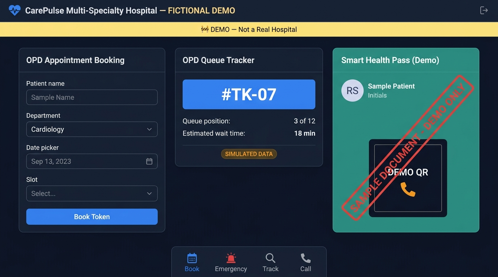

# CarePulse — Fictional Hospital Demo Portal

> ⚠️ **This is a fictional demo project. It is not a real hospital, clinic, or medical service.**
> **No real patient data is collected. All records, tokens, and documents are simulated.**

[](https://hospital-project-tawny.vercel.app/)
[](#6-local-setup--testing-guide)



---

## 1. What This Is

CarePulse is a **front-end portfolio demonstration** of a modern healthcare OPD portal built to showcase:

- Realistic healthcare UX patterns: appointment booking, simulated OPD queue tracking, tele-consult Rx, Smart Health Pass
- **Strict demo honesty** — every document carries a "SAMPLE DOCUMENT – DEMO ONLY" watermark; downloaded PNGs/PDFs have a baked-in diagonal watermark; all live-looking data is labelled "SIMULATED DATA"
- A production-quality security posture: strict CSP with no `unsafe-inline` scripts, `noindex`, no external SDK leakage to standard visitors
- Progressive Web App (PWA) with offline support and trilingual UI (English · हिन्दी · ਪੰਜਾਬੀ)

> **Nothing in this project should be read as medical advice, diagnosis, or official healthcare information.**

---

## 2. Demo Honesty Markers

| Element | What the marker says |
|---|---|
| `<meta name="robots">` | `noindex, nofollow` — search engines won't index it |
| Meta description | Explicitly says "Demonstration … prototype" |
| Every sample document (`#token-slip-card`, `#lab-report-output`, `#tele-rx-panel`, `#smart-health-pass-card`) | `data-demo="sample-doc stamp"` — red print watermark on screen and in downloaded files |
| ICU telemetry panel, Live 24/7 tile | Amber **SIMULATED DATA** chip inline |
| Registration / trust badges | Labelled `Demo Concept` / `Demo-PMC-38214 (Sample Profile)` |
| Downloaded PNG tokens | Diagonal `DEMO – NOT A REAL APPOINTMENT` text drawn directly into the canvas before export |
| PDF/print Rx & passes | Same diagonal watermark injected into the print window's body |
| In-memory QR placeholder | **DEMO QR** phone-icon label — not a scannable code |
| Sign-in badge | "Simulated Session" |
| Firebase & EmailJS SDKs | Loaded **only** when `?dev=1` is in the URL — standard visitors never download them |

---

## 3. Technical Architecture

| Layer | Technology |
|---|---|
| Markup | Vanilla HTML5 — semantic, ARIA-complete, 28 accessible dialog modals |
| Styling | Vanilla CSS3 — 5 modular files (`base`, `components`, `modals`, `themes`, `fonts`) |
| Logic | 19 ES2022 modules (`js/`) + `app.js` fallback bundle |
| Pass rendering | Native HTML5 Canvas 2D — no jsPDF, html2canvas, or icon fonts |
| QR codes | 100% in-memory vector SVG — zero network calls, zero PHI leaves the browser |
| CSP | **Single HTTP header** (no `<meta>` duplication): `script-src 'self' cdn.jsdelivr.net gstatic.com` — no `unsafe-inline`, no `unsafe-eval` |
| Hosting | Vercel (edge CDN, automatic HTTPS) |

### External Integration Endpoints (Allowlisted via CSP)

* **EmailJS SDK** (`cdn.jsdelivr.net`, `api.emailjs.com`) — dev mode only (`?dev=1`)
* **Firebase Compat SDK** (`www.gstatic.com`, `identitytoolkit.googleapis.com`) — dev mode only (`?dev=1`)
* **Unsplash CDN** (`images.unsplash.com`) — sample photography only

---

## 4. Security Headers (via `vercel.json`)

```
Content-Security-Policy   script-src 'self' + trusted CDNs only; no unsafe-inline
X-Content-Type-Options    nosniff
X-Frame-Options           SAMEORIGIN
Referrer-Policy           strict-origin-when-cross-origin
Permissions-Policy        camera=(self), microphone=(self), geolocation=()
```

All inline `onclick=...` handlers have been migrated to decoupled `data-action` listeners.

---

## 5. Accessibility (WCAG 2.2 AA Foundation)

* **28 modals** each have `role="dialog"`, `aria-modal="true"`, and `aria-labelledby`
* Keyboard focus trapping inside open dialogs; `Escape` dismissal
* `@media (prefers-reduced-motion: reduce)` disables decorative animations
* 44×44 px minimum touch targets on mobile dock

*Automated tests verify structural ARIA markup and CSS media queries. Full WCAG 2.2 AA certification additionally requires independent screen-reader verification.*

---

## 6. Local Setup & Testing Guide

**Prerequisites:** Python 3.10+ and Google Chrome / Edge (for browser E2E tests).

```bash
# Serve locally
python -m http.server 3000
# → open http://localhost:3000
```

### Running the Test Suites

```bash
# 1. Full unit + functional + V8 syntax suite (31 tests)
python -m unittest discover -s tests

# 2. No-overclaims regression guard (5 tests — banned phrases, noindex, data-demo markers)
python -m unittest tests.test_no_overclaims -v

# 3. Deep CLI validation (104 checks — HTML, CSS, JS, CSP, mirrors, i18n)
python tests/cli_deep_validation.py

# 4. Real-browser E2E (headless Chrome/Edge)
python tests/test_browser_e2e.py

# 5. Playwright spec (if Playwright is installed)
npx playwright test
```

**All 31 unit tests and 104 CLI checks pass with 0 failures.**

---

## 7. Project Structure

```
hospital-project/
├── index.html              # Main entry (SHA-256 identical mirror of hospital.html)
├── hospital.html           # Alternate entry — byte-for-byte identical
├── app.js                  # Fallback ES module bundle
├── css/
│   ├── base.css            # Design tokens & resets
│   ├── components.css      # UI components + demo-doc print watermark (word-match [data-demo~=...])
│   ├── modals.css          # 28 dialog modals
│   ├── themes.css          # Dark / light / high-contrast themes
│   └── fonts.css           # Self-hosted WOFF2 font declarations
├── js/                     # 19 ES2022 modules
│   ├── gateway.js          # Dev-only SDK loader (EmailJS + Firebase, gated on ?dev=1)
│   ├── tokens.js           # OPD token slip + canvas watermark on PNG download
│   ├── healthcard.js       # Smart Health Pass (print watermark + DEMO QR label)
│   ├── tele.js             # Tele-consult Rx + print-window watermark
│   ├── utils.js            # In-memory SVG QR generator (DEMO QR label, no network fallback)
│   └── ...                 # booking, queue, lab, pharmacy, i18n, auth, calculators, ...
├── fonts/                  # 12 self-hosted WOFF2 files (Noto Devanagari + Gurmukhi)
├── tests/
│   ├── test_suite.py               # 26-test unit + V8 syntax suite
│   ├── test_no_overclaims.py       # 5-test overclaims regression guard
│   ├── cli_deep_validation.py      # 104-check deep CLI suite
│   ├── test_browser_e2e.py         # Headless Chrome/Edge E2E runner
│   └── e2e_real_page.spec.js       # Playwright spec
├── vercel.json             # Routing + security headers (single CSP source of truth)
├── manifest.json           # PWA manifest
└── sw.js                   # Service worker (39 precached assets)
```

---

## 8. Offline PWA

The Service Worker precaches 39 assets — both HTML shells, all 5 CSS files, 6 offline font files, 18 JS modules, and `app.js` — so the portal is fully usable offline after first visit.

---

## 9. Privacy & Data

All patient data is simulated, client-side only, and stored in `localStorage`. No data is sent to any server during normal use.

* ABHA numbers: `00-0000-0000-0001 (Demo Sample)` — obviously fake
* Phone numbers: `9000000000` — generic dummy
* `clearAllDemoData()` — one-click purge exposed in the browser console
* DPDP Act 2023: Consent checkbox on booking; demo designed in alignment with its principles
* QR payload: only opaque `?track=...&ref=...` identifiers — **zero personal health data**

---

## 10. Mirror Parity Architecture

Both entry points [`index.html`](index.html) and [`hospital.html`](hospital.html) are bit-for-bit SHA-256 identical, verified automatically in every test run.

---

## License

This repository is a **portfolio demonstration project**. It is not affiliated with any real healthcare institution.
